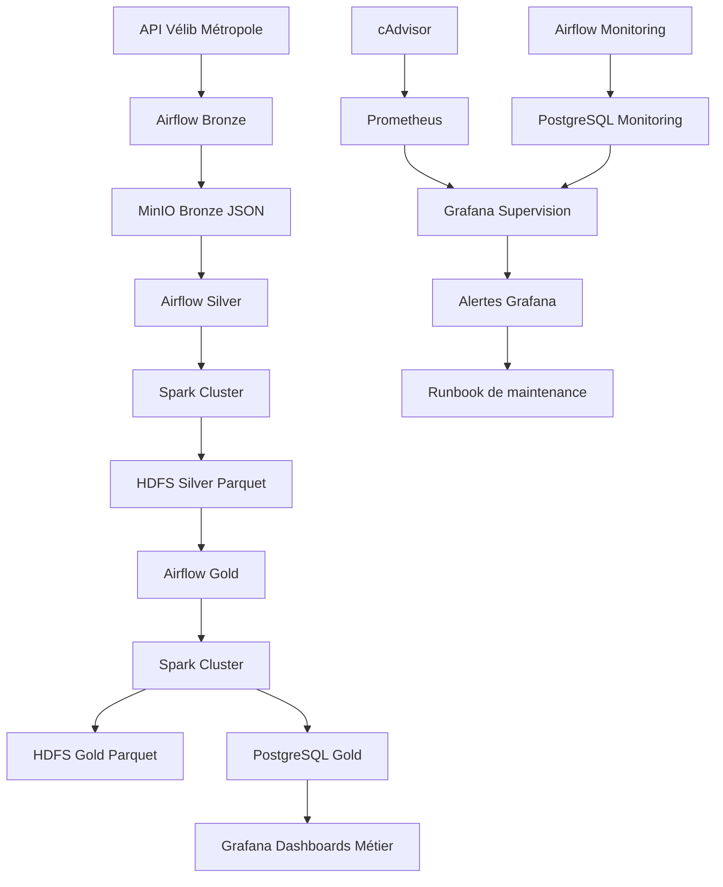

# VélibData — Plateforme Big Data distribuée

## Présentation du projet

VélibData est une plateforme Big Data conçue pour collecter, stocker, transformer, superviser et restituer les données ouvertes du service Vélib' Métropole.

Le projet s'inscrit dans le cadre de la MSPR Big Data et vise à mettre en place une architecture distribuée, maintenable et supervisée, capable de traiter des données quasi temps réel issues des API Vélib.

L'objectif principal est de suivre l'état du réseau Vélib, d'analyser la disponibilité des stations et de fournir des indicateurs exploitables via des dashboards Grafana.

---

## Objectifs

La plateforme permet de répondre aux besoins suivants :

- collecter automatiquement les données Vélib depuis les API publiques ;
- stocker les données brutes dans une couche Bronze ;
- transformer les données en couches Silver et Gold ;
- utiliser HDFS comme stockage distribué principal ;
- exécuter les traitements avec Spark ;
- orchestrer les pipelines avec Airflow ;
- restituer les données analytiques dans PostgreSQL et Grafana ;
- superviser l'infrastructure, les pipelines et la qualité des données ;
- mettre en place des alertes et des procédures de maintenance.

---

## Architecture globale



---

## Composants techniques

| Composant | Rôle |
|---|---|
| Docker Compose | Déploiement local de la plateforme |
| Airflow | Orchestration des pipelines |
| MinIO | Stockage Bronze des fichiers JSON bruts |
| HDFS | Stockage distribué des couches Silver et Gold |
| Spark | Traitement distribué des données |
| PostgreSQL | Restitution des tables Gold et historisation du monitoring |
| Grafana | Dashboards métier, supervision et alerting |
| Prometheus | Collecte des métriques techniques |
| cAdvisor | Supervision CPU et mémoire des conteneurs |
| Docker Socket Proxy | Démarrage contrôlé d'un worker Spark supplémentaire pour l'autoscaling |

---

## Pipeline de données

Le pipeline est organisé en plusieurs couches.

### Couche Bronze

Les données sont collectées depuis les API Vélib et stockées au format JSON brut dans MinIO.

Sources utilisées :

- station_information
- station_status

### Couche Silver

Les données Bronze sont transformées par Spark, nettoyées et stockées dans HDFS au format Parquet.

Cette couche contient des données structurées et exploitables.

### Couche Gold

La couche Gold contient les données analytiques utilisées pour les dashboards Grafana.

Elle est stockée dans HDFS au format Parquet et répliquée dans PostgreSQL pour faciliter la restitution.

Tables principales :

- gold.disponibilite_courante
- gold.tendance_horaire
- gold.kpi_reseau_courant
- gold.kpi_reseau_historique

---

## Supervision et monitoring

La plateforme intègre un dispositif de supervision complet.

Les métriques suivies concernent :

- l'état du cluster HDFS ;
- les DataNodes actifs ou indisponibles ;
- les blocs manquants, corrompus ou sous-répliqués ;
- l'utilisation du stockage HDFS ;
- l'état des pipelines Airflow ;
- la qualité des données ;
- la mémoire et le CPU des conteneurs ;
- les incidents critiques de la plateforme.

Les résultats de monitoring sont historisés dans PostgreSQL dans le schéma monitoring.

Tables principales :

- monitoring.check_results
- monitoring.hdfs_cluster_metrics
- monitoring.dataset_metrics

---

## Alerting

Des alertes Grafana sont configurées pour détecter automatiquement les anomalies.

Exemples d'alertes :

- CRITICAL - DataNode HDFS mort
- CRITICAL - HDFS blocs manquants
- WARNING - HDFS blocs sous-répliqués
- WARNING - Stockage HDFS élevé
- WARNING - CPU conteneur élevé
- WARNING - Mémoire conteneur élevée
- CRITICAL - Incident plateforme détecté
- CRITICAL - Monitoring non exécuté

Les alertes sont reliées à un contact email et à un runbook de maintenance.

---

## Autoscaling

Un mécanisme d'autoscaling local a été ajouté pour adapter les ressources Spark.

Le principe est le suivant :

1. Prometheus collecte les métriques CPU.
2. Airflow exécute le DAG velib_spark_autoscaling.
3. Le DAG analyse la charge des conteneurs Spark.
4. Si le seuil est dépassé, un worker Spark supplémentaire est démarré.
5. Spark Master détecte automatiquement le nouveau worker disponible.

Ce mécanisme permet de démontrer une montée en charge contrôlée dans un environnement Docker Compose.

---

## Documentation

La documentation du projet est centralisée dans le dossier docs.

Elle contient notamment :

- la documentation d'architecture ;
- le protocole de maintenance ;
- le guide de sauvegarde et restauration ;
- la documentation de dimensionnement et scalabilité ;
- les captures de preuve associées aux compétences ;
- les guides utilisateur et métier.

Documents importants :

- docs/runbook_maintenance.md
- docs/backup_restore.md
- docs/dimensionnement_scalabilite.md

---

## Démarrage de la plateforme

Depuis la racine du projet :

```bash
docker compose up -d
```

Vérifier les conteneurs :

```bash
docker ps
```

Accès aux interfaces principales :

| Service | URL |
|---|---|
| Airflow | http://localhost:8080 |
| Spark Master | http://localhost:8088 |
| HDFS NameNode | http://localhost:9870 |
| Grafana | http://localhost:3000 |
| Prometheus | http://localhost:9090 |
| cAdvisor | http://localhost:8085 |
| MinIO | http://localhost:9001 |

---

## Exécution des pipelines

Les principaux DAGs Airflow sont :

| DAG | Rôle |
|---|---|
| velib_bronze_ingestion | Ingestion des données Vélib vers MinIO |
| velib_silver_transformation | Transformation Bronze vers Silver HDFS |
| velib_gold_transformation | Transformation Silver vers Gold HDFS et PostgreSQL |
| velib_monitoring | Contrôles HDFS, qualité, pipelines et stockage |
| velib_spark_autoscaling | Autoscaling local des workers Spark |

---

## Maintenance

Un runbook de maintenance est fourni afin de guider les actions en cas d'incident.

Exemples de procédures documentées :

- relancer un DataNode HDFS ;
- vérifier les blocs HDFS avec fsck ;
- exécuter le balancer HDFS ;
- relancer un DAG Airflow ;
- restaurer PostgreSQL ;
- reconstruire les couches Silver et Gold ;
- analyser une alerte Grafana.

---

## Sauvegarde et reprise

La stratégie de reprise repose sur la reconstruction progressive des couches de données :

```
Bronze MinIO
    ↓
Silver HDFS
    ↓
Gold HDFS
    ↓
PostgreSQL Gold
```

Cette approche permet de restaurer ou reconstruire la plateforme en cas d'incident sur une couche transformée.

---

## Versionnement et CI

Le projet est versionné avec Git et GitHub.

Un workflow GitHub Actions vérifie notamment :

- la configuration Docker Compose ;
- la syntaxe Python ;
- la présence des dossiers essentiels ;
- la présence des fichiers de documentation.

Le workflow CI permet de sécuriser les modifications avant intégration.

---

## Sécurité

Les fichiers contenant des secrets ou des données sensibles ne doivent pas être versionnés.

Les fichiers suivants sont ignorés par Git :

```
.env
.env.*
backups/
*.log
```

Les identifiants, mots de passe, tokens et sauvegardes locales doivent rester hors du dépôt GitHub.

---

## État du projet

La plateforme met en œuvre :

- un stockage distribué HDFS ;
- des traitements Spark ;
- une orchestration Airflow ;
- une restitution PostgreSQL et Grafana ;
- une supervision Prometheus / cAdvisor / Grafana ;
- des alertes automatiques ;
- un mécanisme d'autoscaling local ;
- une documentation de maintenance et de reprise.

Le projet constitue une plateforme Big Data complète, distribuée, supervisée et documentée.
