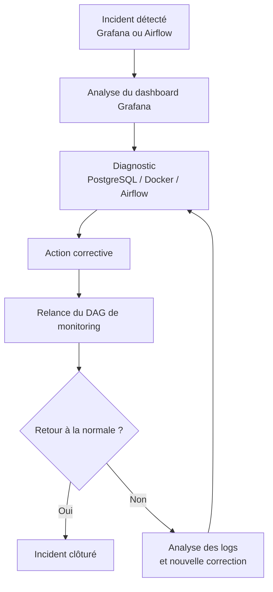

# Runbook de Maintenance — Plateforme Big Data Vélib

> **Document de référence opérationnelle**
> Audience : équipe technique — infrastructure & données
> Dernière mise à jour : 2026-07-01

---

## Table des matières

1. [Objectif](#1-objectif)
2. [Composants de la plateforme](#2-composants-de-la-plateforme)
3. [Schéma général de maintenance](#3-schéma-général-de-maintenance)
4. [Maintenance préventive](#4-maintenance-préventive)
5. [Incident — DataNode HDFS indisponible](#5-incident--datanode-hdfs-indisponible)
6. [Incident — Blocs HDFS sous-répliqués](#6-incident--blocs-hdfs-sous-répliqués)
7. [Incident — Blocs HDFS manquants](#7-incident--blocs-hdfs-manquants)
8. [Incident — Bronze MinIO non alimenté](#8-incident--bronze-minio-non-alimenté)
9. [Incident — Silver HDFS en erreur](#9-incident--silver-hdfs-en-erreur)
10. [Incident — Gold ou PostgreSQL en erreur](#10-incident--gold-ou-postgresql-en-erreur)
11. [Incident — Monitoring non exécuté](#11-incident--monitoring-non-exécuté)
12. [Incident — Capacité HDFS élevée](#12-incident--capacité-hdfs-élevée)
13. [Référence des commandes utiles](#13-référence-des-commandes-utiles)

---

## 1. Objectif

Ce runbook décrit les procédures de maintenance préventive et curative de la plateforme Big Data Vélib. Il constitue le guide de référence pour toute intervention sur l'infrastructure, la pipeline de données, le stockage distribué HDFS, l'orchestration Airflow, la base PostgreSQL ou les dashboards Grafana.

### Démarche d'intervention standard

| Étape | Action |
|:-----:|--------|
| 1 | Détecter l'incident via Grafana ou Airflow |
| 2 | Diagnostiquer la cause racine |
| 3 | Appliquer l'action corrective |
| 4 | Vérifier le retour à la normale |
| 5 | Consigner via le DAG de monitoring |

---

## 2. Composants de la plateforme

| Composant | Rôle |
|-----------|------|
| **MinIO** | Stockage Bronze — fichiers JSON bruts issus de l'API Vélib |
| **HDFS** | Stockage distribué des couches Silver et Gold |
| **Spark** | Traitements distribués Bronze → Silver → Gold |
| **Airflow** | Orchestration et planification des DAGs |
| **PostgreSQL** | Restitution Gold et stockage des métriques de monitoring |
| **Grafana** | Dashboards de supervision et système d'alertes email |

---

## 3. Schéma général de maintenance



---

## 4. Maintenance préventive

La maintenance préventive consiste à surveiller en continu la plateforme afin d'anticiper et prévenir les interruptions de service. Les contrôles sont entièrement automatisés via le DAG Airflow `velib_monitoring`. Les résultats sont persistés dans le schéma `monitoring` de PostgreSQL et visualisés dans Grafana.

| Élément surveillé | Règle de contrôle | Objectif |
|-------------------|-------------------|----------|
| DataNodes HDFS | Alerte si un DataNode est indisponible | Détecter une panne de nœud |
| Blocs HDFS manquants | Alerte `CRITICAL` si `missing_blocks > 0` | Détecter un risque de perte de données |
| Blocs sous-répliqués | Alerte `WARNING` si `under_replicated_blocks > 0` | Détecter une réplication dégradée |
| Capacité HDFS | Alerte si utilisation > 80 % | Anticiper la saturation du stockage |
| Fraîcheur Bronze (MinIO) | Alerte si les fichiers Bronze ne sont plus récents | Vérifier l'ingestion des données brutes |
| Fraîcheur Silver (HDFS) | Alerte si Silver n'est plus mis à jour | Vérifier la fraîcheur des données transformées |
| Pipeline globale | Alerte si Bronze, Silver, Gold ou PostgreSQL est en erreur | Détecter toute rupture de traitement |
| Supervision | Alerte si le DAG de monitoring ne s'exécute plus | Garantir la continuité de la supervision |

---

## 5. Incident — DataNode HDFS indisponible

### 5.1 Détection

**Alerte Grafana :**

```
CRITICAL — HDFS DataNode indisponible
```

**Métriques observées :**

| Métrique | Valeur normale | Valeur en incident |
|----------|:--------------:|:------------------:|
| `live_nodes` | 2 | 1 |
| `dead_nodes` | 0 | 1 |
| `under_replicated_blocks` | 0 | > 0 |

> Un ou plusieurs DataNodes HDFS sont arrêtés ou inaccessibles. La réplication des blocs est dégradée.

### 5.2 Diagnostic

**Vérifier l'état des conteneurs Docker :**

```powershell
docker compose ps
```

**Consulter les métriques HDFS dans PostgreSQL :**

```powershell
docker exec -it velib_postgres psql -U velib_user -d velibdata -c "
SELECT check_time, live_nodes, dead_nodes, missing_blocks, under_replicated_blocks
FROM monitoring.hdfs_cluster_metrics
ORDER BY check_time DESC LIMIT 5;"
```

### 5.3 Action corrective

**Relancer le DataNode arrêté :**

```powershell
docker compose start hdfs-datanode-2
```

Patienter 30 à 60 secondes que le cluster HDFS se stabilise et que la réplication reprenne.

### 5.4 Vérification

**Déclencher le DAG de monitoring :**

```powershell
docker exec -it velib_airflow_scheduler airflow dags trigger velib_monitoring
```

**Contrôler les métriques mises à jour :**

```powershell
docker exec -it velib_postgres psql -U velib_user -d velibdata -c "
SELECT check_time, live_nodes, dead_nodes, missing_blocks, under_replicated_blocks
FROM monitoring.hdfs_cluster_metrics
ORDER BY check_time DESC LIMIT 5;"
```

**Résultat attendu :**

| Métrique | Valeur attendue |
|----------|:--------------:|
| `live_nodes` | 2 |
| `dead_nodes` | 0 |
| `missing_blocks` | 0 |

---

## 6. Incident — Blocs HDFS sous-répliqués

### 6.1 Détection

**Alerte Grafana :**

```
WARNING — HDFS blocs sous-répliqués
```

> Les données sont encore disponibles, mais le niveau de réplication HDFS attendu n'est plus respecté. Le risque d'indisponibilité est accru.

### 6.2 Diagnostic

```powershell
docker exec -it velib_postgres psql -U velib_user -d velibdata -c "
SELECT check_time, live_nodes, dead_nodes, under_replicated_blocks
FROM monitoring.hdfs_cluster_metrics
ORDER BY check_time DESC LIMIT 5;"
```

### 6.3 Action corrective

**Si un DataNode est arrêté, le relancer :**

```powershell
docker compose start hdfs-datanode-2
```

**Puis déclencher le monitoring :**

```powershell
docker exec -it velib_airflow_scheduler airflow dags trigger velib_monitoring
```

---

## 7. Incident — Blocs HDFS manquants

### 7.1 Détection

**Alerte Grafana :**

```
CRITICAL — HDFS blocs manquants
```

> Alerte critique. Des blocs sont inaccessibles, ce qui peut indiquer une indisponibilité ou une perte partielle de données.

### 7.2 Diagnostic

```powershell
docker exec -it velib_postgres psql -U velib_user -d velibdata -c "
SELECT check_time, missing_blocks, under_replicated_blocks
FROM monitoring.hdfs_cluster_metrics
ORDER BY check_time DESC LIMIT 5;"
```

### 7.3 Actions correctives

| Cause probable | Action corrective |
|----------------|-------------------|
| DataNode arrêté | Relancer le DataNode (`docker compose start hdfs-datanode-2`) |
| Fichier incomplet | Relancer le DAG de traitement concerné |
| Écriture Spark échouée | Inspecter les logs Spark et relancer le DAG |
| Données corrompues | Régénérer les données depuis la couche Bronze ou Silver |

---

## 8. Incident — Bronze MinIO non alimenté

### 8.1 Détection

**Alerte Grafana :**

```
CRITICAL — Bronze MinIO non alimenté
```

> Aucun fichier récent n'est présent dans MinIO. L'ingestion des données brutes est interrompue.

### 8.2 Diagnostic

**Vérifier les contrôles Bronze dans PostgreSQL :**

```powershell
docker exec -it velib_postgres psql -U velib_user -d velibdata -c "
SELECT check_time, component, layer_name, check_name, status, metric_value, details
FROM monitoring.check_results
WHERE layer_name = 'Bronze'
ORDER BY check_time DESC LIMIT 10;"
```

**Vérifier l'historique du DAG Bronze :**

```powershell
docker exec -it velib_airflow_scheduler airflow dags list-runs -d velib_bronze_ingestion --limit 5
```

### 8.3 Action corrective

**Relancer le DAG d'ingestion Bronze :**

```powershell
docker exec -it velib_airflow_scheduler airflow dags trigger velib_bronze_ingestion
```

**Puis relancer le monitoring :**

```powershell
docker exec -it velib_airflow_scheduler airflow dags trigger velib_monitoring
```

---

## 9. Incident — Silver HDFS en erreur

### 9.1 Détection

**Alerte Grafana :**

```
CRITICAL — Silver HDFS en erreur
```

> Cet incident peut résulter de l'absence du dossier Silver dans HDFS, de l'absence de fichiers Parquet, d'un dataset vide ou d'un traitement Spark incomplet.

### 9.2 Diagnostic

**Vérifier les contrôles Silver dans PostgreSQL :**

```powershell
docker exec -it velib_postgres psql -U velib_user -d velibdata -c "
SELECT check_time, component, layer_name, check_name, status, details
FROM monitoring.check_results
WHERE layer_name = 'Silver'
ORDER BY check_time DESC LIMIT 20;"
```

**Vérifier l'historique du DAG Silver :**

```powershell
docker exec -it velib_airflow_scheduler airflow dags list-runs -d velib_silver_transformation --limit 5
```

### 9.3 Action corrective

**Relancer le DAG de transformation Silver :**

```powershell
docker exec -it velib_airflow_scheduler airflow dags trigger velib_silver_transformation
```

**Puis relancer le monitoring :**

```powershell
docker exec -it velib_airflow_scheduler airflow dags trigger velib_monitoring
```

---

## 10. Incident — Gold ou PostgreSQL en erreur

### 10.1 Détection

**Alerte Grafana :**

```
CRITICAL — Erreurs pipeline ou qualité
```

### 10.2 Diagnostic

**Vérifier le contenu des tables Gold :**

```powershell
docker exec -it velib_postgres psql -U velib_user -d velibdata -c "SELECT COUNT(*) FROM gold.disponibilite_courante;"
docker exec -it velib_postgres psql -U velib_user -d velibdata -c "SELECT COUNT(*) FROM gold.tendance_horaire;"
docker exec -it velib_postgres psql -U velib_user -d velibdata -c "SELECT COUNT(*) FROM gold.kpi_reseau_historique;"
```

**Vérifier l'historique du DAG Gold :**

```powershell
docker exec -it velib_airflow_scheduler airflow dags list-runs -d velib_gold_transformation --limit 5
```

### 10.3 Action corrective

**Relancer le DAG de transformation Gold :**

```powershell
docker exec -it velib_airflow_scheduler airflow dags trigger velib_gold_transformation
```

**Puis relancer le monitoring :**

```powershell
docker exec -it velib_airflow_scheduler airflow dags trigger velib_monitoring
```

---

## 11. Incident — Monitoring non exécuté

### 11.1 Détection

**Alerte Grafana :**

```
CRITICAL — Monitoring non exécuté depuis plus de 20 minutes
```

### 11.2 Diagnostic

**Vérifier les derniers runs du DAG monitoring :**

```powershell
docker exec -it velib_airflow_scheduler airflow dags list-runs -d velib_monitoring --limit 5
```

**Vérifier l'état du scheduler Airflow :**

```powershell
docker compose ps airflow-scheduler
```

### 11.3 Action corrective

**Déclencher manuellement le DAG de monitoring :**

```powershell
docker exec -it velib_airflow_scheduler airflow dags trigger velib_monitoring
```

**Si le scheduler Airflow est arrêté, le relancer :**

```powershell
docker compose start airflow-scheduler
```

---

## 12. Incident — Capacité HDFS élevée

### 12.1 Détection

**Alerte Grafana :**

```
WARNING — HDFS stockage élevé
```

**Seuil de déclenchement :** `capacity_used_percent > 80 %`

### 12.2 Diagnostic

```powershell
docker exec -it velib_postgres psql -U velib_user -d velibdata -c "
SELECT check_time, capacity_total_gb, capacity_used_gb, capacity_remaining_gb, capacity_used_percent
FROM monitoring.hdfs_cluster_metrics
ORDER BY check_time DESC LIMIT 5;"
```

### 12.3 Actions correctives

| Situation | Action recommandée |
|-----------|--------------------|
| Accumulation de fichiers anciens | Nettoyer ou archiver les données obsolètes |
| Historisation excessive | Réduire la durée de conservation des données |
| Capacité structurellement insuffisante | Ajouter un DataNode HDFS |
| Croissance normale et continue | Planifier une extension de l'infrastructure de stockage |

---

## 13. Référence des commandes utiles

### État général de la plateforme

```powershell
# État de tous les conteneurs Docker
docker compose ps
```

### Incidents actifs

```powershell
# Derniers contrôles en échec ou en warning
docker exec -it velib_postgres psql -U velib_user -d velibdata -c "
SELECT check_time, component, layer_name, check_name, status, severity, metric_value
FROM monitoring.check_results
WHERE status IN ('FAILED', 'WARNING')
ORDER BY check_time DESC LIMIT 20;"
```

### État du cluster HDFS

```powershell
docker exec -it velib_postgres psql -U velib_user -d velibdata -c "
SELECT check_time, live_nodes, dead_nodes, missing_blocks, under_replicated_blocks
FROM monitoring.hdfs_cluster_metrics
ORDER BY check_time DESC LIMIT 5;"
```

### Relance du monitoring

```powershell
docker exec -it velib_airflow_scheduler airflow dags trigger velib_monitoring
```

### Relance d'un DataNode

```powershell
docker compose start hdfs-datanode-2
```

---

*Document maintenu par l'équipe Data Engineering — Projet MSPR Vélib*
